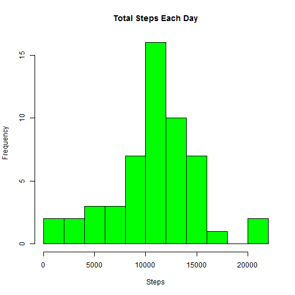

PA1_template.Rmd
==================
</br>

<h2>Loading and preprocessing the data</h2>

<h3>1.Load the data (i.e. read.csv())</h3>


```r
setwd("~/R/05_ReproducibleResearch/RepData_PeerAssessment1")
unzip("activity.zip", exdir ="activity")
all <- read.csv("activity/activity.csv", ) #read in data
```

</br>
<h3>2.Process/transform the data (if necessary) into a format suitable for your analysis</h3>


```r
cc <- all[complete.cases(all),] #remove NAs for primary analysis
cc$date <- as.Date(cc$date, format = "%Y-%m-%d") #convert dates upfront before analysis
```

</br>

<h2>What is mean total number of steps taken per day?</h2>

<h3>1.Make a histogram of the total number of steps taken each day</h3>

<h4>Gather Data</h4>


```r
attach(cc) #create ability to reference dataset variables
#Sum, mean and median steps taken per day?
daytots <- aggregate(cc$steps, by = list(cc$date), sum) #sum of steps over study period
names(daytots) <- (c("date", "steps")) #rename cols
```

<h4>Mean steps per day data


```r
daytots
```

```
##          date steps
## 1  2012-10-02   126
## 2  2012-10-03 11352
## 3  2012-10-04 12116
## 4  2012-10-05 13294
## 5  2012-10-06 15420
## 6  2012-10-07 11015
## 7  2012-10-09 12811
## 8  2012-10-10  9900
## 9  2012-10-11 10304
## 10 2012-10-12 17382
## 11 2012-10-13 12426
## 12 2012-10-14 15098
## 13 2012-10-15 10139
## 14 2012-10-16 15084
## 15 2012-10-17 13452
## 16 2012-10-18 10056
## 17 2012-10-19 11829
## 18 2012-10-20 10395
## 19 2012-10-21  8821
## 20 2012-10-22 13460
## 21 2012-10-23  8918
## 22 2012-10-24  8355
## 23 2012-10-25  2492
## 24 2012-10-26  6778
## 25 2012-10-27 10119
## 26 2012-10-28 11458
## 27 2012-10-29  5018
## 28 2012-10-30  9819
## 29 2012-10-31 15414
## 30 2012-11-02 10600
## 31 2012-11-03 10571
## 32 2012-11-05 10439
## 33 2012-11-06  8334
## 34 2012-11-07 12883
## 35 2012-11-08  3219
## 36 2012-11-11 12608
## 37 2012-11-12 10765
## 38 2012-11-13  7336
## 39 2012-11-15    41
## 40 2012-11-16  5441
## 41 2012-11-17 14339
## 42 2012-11-18 15110
## 43 2012-11-19  8841
## 44 2012-11-20  4472
## 45 2012-11-21 12787
## 46 2012-11-22 20427
## 47 2012-11-23 21194
## 48 2012-11-24 14478
## 49 2012-11-25 11834
## 50 2012-11-26 11162
## 51 2012-11-27 13646
## 52 2012-11-28 10183
## 53 2012-11-29  7047
```

</br>
<h4>Create Histogram</h4>


```r
hist(daytots$steps, main = "Total Steps Each Day", col = "green", breaks = 10,
     xlab = "Steps")
```

 

</br>
<h3>2. Calculate and report the mean and median total number of steps taken per day</h3>
</br>
<h4>The mean is:</h4>


```r
mean(daytots$steps) #mean steps over study period
```

```
## [1] 10766.19
```

</br>
<h4>The median is:</h4>


```r
median(daytots$steps) #median steps over study period
```

```
## [1] 10765
```

</br>
<h2>What is the average daily activity pattern?</h2>
</br>
<h3>1. Make a time series plot (i.e. type = "l") of the 5-minute interval (x-axis) and the average number of steps taken, averaged across all days (y-axis)</h3>
</br>

```r
#Aggregated means by daily activity interval
actmeans <- aggregate(cc$steps, by = list(cc$interval), mean) #mean of steps by activity
names(actmeans) <- (c("interval", "steps"))
#Timeseries sparkline for mean steps per interval over study period
plot(actmeans$interval, actmeans$steps, type = "l", ylab = "Average Steps", xlab = "5-Minute Intervals")
```

 

</br>
<h3>2. Which 5-minute interval, on average across all the days in the dataset,contains the maximum number of steps?</h3>
</br>
<h4>The max occurs at interval...</h4>


```r
actmeans$interval[which.max(actmeans$steps)]
```

```
## [1] 835
```

<h4> The maximum number of steps across all intervals is...</h4>


```r
max(actmeans$steps)
```

```
## [1] 206.1698
```


</br>
<h2>Imputing missing values</h2>
</br>
<h3>1. Calculate and report the total number of missing values in the dataset (i.e. the total number of rows with NAs)</h3>
</br>

```r
#NA summary analyis
all <- read.csv("activity/activity.csv", ) #read in data
all$date <- as.Date(all$date, format = "%Y-%m-%d") #convert dates upfront before analysis
sum(is.na(all$steps)) #number if NAs
```

```
## [1] 2304
```

</br>
<h3>2. Devise a strategy for filling in all of the missing values in the dataset. The strategy does not need to be sophisticated. For example, you could use the mean/median for that day, or the mean for that 5-minute interval, etc. & 3. Create a new dataset that is equal to the original dataset but with the missing data filled in.</h3>

</br>

<h4>I decided to impute data using the activity interval means.  I also decided to manipulate the NA dataset separately and then rbind it back to the complete cases dataset. </h4>

</br>


```r
#Impute data by activity means
ccNA <- all[!complete.cases(all),] #Produce dataset of all NAs
NAimpute <- merge(ccNA, actmeans, by = "interval", sort = FALSE) #Merge NA dataset with activity means
NAimputed <- NAimpute[ ,c(4,3,1)] #reset columns
names(NAimputed) <- c("steps","date","interval") #rename columns
imputedData <- rbind(cc,NAimputed) #Join datasets with actual and imputed data
str(imputedData)
```

```
## 'data.frame':	17568 obs. of  3 variables:
##  $ steps   : num  0 0 0 0 0 0 0 0 0 0 ...
##  $ date    : Date, format: "2012-10-02" "2012-10-02" ...
##  $ interval: int  0 5 10 15 20 25 30 35 40 45 ...
```

```r
summary(imputedData)
```

```
##      steps             date               interval     
##  Min.   :  0.00   Min.   :2012-10-01   Min.   :   0.0  
##  1st Qu.:  0.00   1st Qu.:2012-10-16   1st Qu.: 588.8  
##  Median :  0.00   Median :2012-10-31   Median :1177.5  
##  Mean   : 37.38   Mean   :2012-10-31   Mean   :1177.5  
##  3rd Qu.: 27.00   3rd Qu.:2012-11-15   3rd Qu.:1766.2  
##  Max.   :806.00   Max.   :2012-11-30   Max.   :2355.0
```

</br>
<h3>4. Make a histogram of the total number of steps taken each day and Calculate and report the mean and median total number of steps taken per day. </h3>


```r
idaytots <- aggregate(imputedData$steps, by = list(imputedData$date), sum) #sum of steps over study period
names(idaytots) <- (c("date", "steps")) #rename cols
```

</br>
<h4>This is the mean...</h4>
</br>

```r
mean(idaytots$steps) #mean steps over study period
```

```
## [1] 10766.19
```

</br>
<h4>This is the median...</h4>


```r
median(idaytots$steps) #median steps over study period
```

```
## [1] 10766.19
```

</br>
<h4>And the histogram...</h4>


```r
hist(idaytots$steps, main = "Total Steps Each Day", col = "green", breaks = 10,
     xlab = "Steps")
```

 

</br>
<h4>Compare original and imputed means for steps (the delta = 0)</h4>
</br>
<h4>The original mean</h4>


```r
mean(daytots$steps) #Original Mean
```

```
## [1] 10766.19
```

</br>
<h4>The imputed mean</h4> 

```r
mean(idaytots$steps) #Imputed Mean
```

```
## [1] 10766.19
```

</br>
<h4>Compare original and imputed medians (the delta = 1.188679)</h4>

<h4>The original median</h4>


```r
median(daytots$steps) #Original Mean
```

```
## [1] 10765
```

</br>
<h4>The imputed median</h4> 

```r
mean(idaytots$steps) #Imputed Mean
```

```
## [1] 10766.19
```

</br>
<h3>Do these values differ from the estimates from the first part of the assignment?</h3>
</br>
<h4>As can be seen below, the net impact of imputing is that we pick up 8 additional days worth of data with the means remaining equal and the median changing only slightly.</h4>


```r
str(daytots)
```

```
## 'data.frame':	53 obs. of  2 variables:
##  $ date : Date, format: "2012-10-02" "2012-10-03" ...
##  $ steps: int  126 11352 12116 13294 15420 11015 12811 9900 10304 17382 ...
```

```r
str(idaytots)
```

```
## 'data.frame':	61 obs. of  2 variables:
##  $ date : Date, format: "2012-10-01" "2012-10-02" ...
##  $ steps: num  10766 126 11352 12116 13294 ...
```

```r
summary(daytots)
```

```
##       date                steps      
##  Min.   :2012-10-02   Min.   :   41  
##  1st Qu.:2012-10-16   1st Qu.: 8841  
##  Median :2012-10-29   Median :10765  
##  Mean   :2012-10-30   Mean   :10766  
##  3rd Qu.:2012-11-16   3rd Qu.:13294  
##  Max.   :2012-11-29   Max.   :21194
```

```r
summary(idaytots)
```

```
##       date                steps      
##  Min.   :2012-10-01   Min.   :   41  
##  1st Qu.:2012-10-16   1st Qu.: 9819  
##  Median :2012-10-31   Median :10766  
##  Mean   :2012-10-31   Mean   :10766  
##  3rd Qu.:2012-11-15   3rd Qu.:12811  
##  Max.   :2012-11-30   Max.   :21194
```

</br>
<h3> What is the impact of imputing missing data on the estimates of the total daily number of steps?</h3>
</br>
<h4>The imputing adds an additional 86130 steps to the datset as graphically represented below.  The good news is that the impacts on the mean and median appear minimal.  This is largely because as can be seen in the chart, the majority of the additional steps were added at/near the mean</h4>


```r
par(mfrow = c(1, 2))
hist(daytots$steps, main = "(NA's Removed)", xlab = "Steps Per Day", col = "green", breaks = 25, ylim =c(0,12))
hist(idaytots$steps, main = "(Imputed Vaules)", xlab = "Steps Per Day", col = "red", breaks = 25, ylim=c(0,12))
```

 

</br>
<h2>Are there differences in activity patterns between weekdays and weekends?</h2>
</br>
<h3>1. Create a new factor variable in the dataset with two levels - "weekday" and "weekend" indicating whether a given date is a weekday or weekend day</h3>
</br>

```r
attach(imputedData)
```

```
## The following objects are masked from cc:
## 
##     date, interval, steps
```

```r
imputedData$day <- weekdays(as.Date(date)) #Use weekdays to extract days 
imputedData$day[imputedData$day == c("Monday")] ="weekday"
imputedData$day[imputedData$day == c("Tuesday")] ="weekday"
imputedData$day[imputedData$day == c("Wednesday")] ="weekday"
imputedData$day[imputedData$day == c("Thursday")] ="weekday"
imputedData$day[imputedData$day == c("Friday")] ="weekday"
imputedData$day[imputedData$day == c("Saturday")] ="weekend"
imputedData$day[imputedData$day == c("Sunday")] ="weekend"
```

</br>
<h3>2. Make a panel plot containing a time series plot (i.e. type = "l") of the 5-minute interval (x-axis) and the average number of steps taken, averaged across all weekday days or weekend days (y-axis). The plot should look something like the following, which was creating using simulated data:</h3>
</br>


```r
imputedDataFinal <- aggregate(imputedData$steps, by = list(imputedData$day, imputedData$interval), mean) #mean of steps by activity
names(imputedDataFinal) <- (c("day", "interval","steps"))
summary(imputedDataFinal)
```

```
##      day               interval          steps        
##  Length:576         Min.   :   0.0   Min.   :  0.000  
##  Class :character   1st Qu.: 588.8   1st Qu.:  2.047  
##  Mode  :character   Median :1177.5   Median : 28.133  
##                     Mean   :1177.5   Mean   : 38.988  
##                     3rd Qu.:1766.2   3rd Qu.: 61.263  
##                     Max.   :2355.0   Max.   :230.378
```


```r
library(lattice)
xyplot(imputedDataFinal$steps ~ imputedDataFinal$interval | imputedDataFinal$day, layout = c(1, 2), type = "l", xlab = "Interval", 
       ylab = "Number of steps")
```

 
